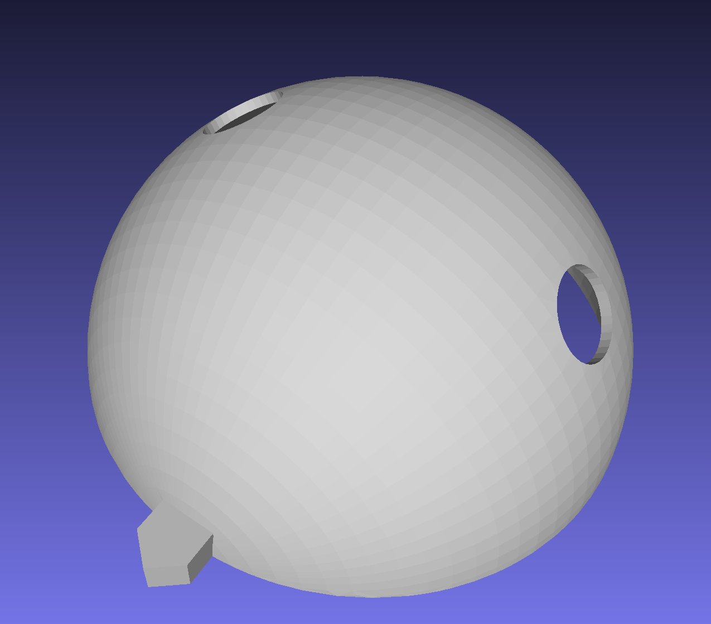
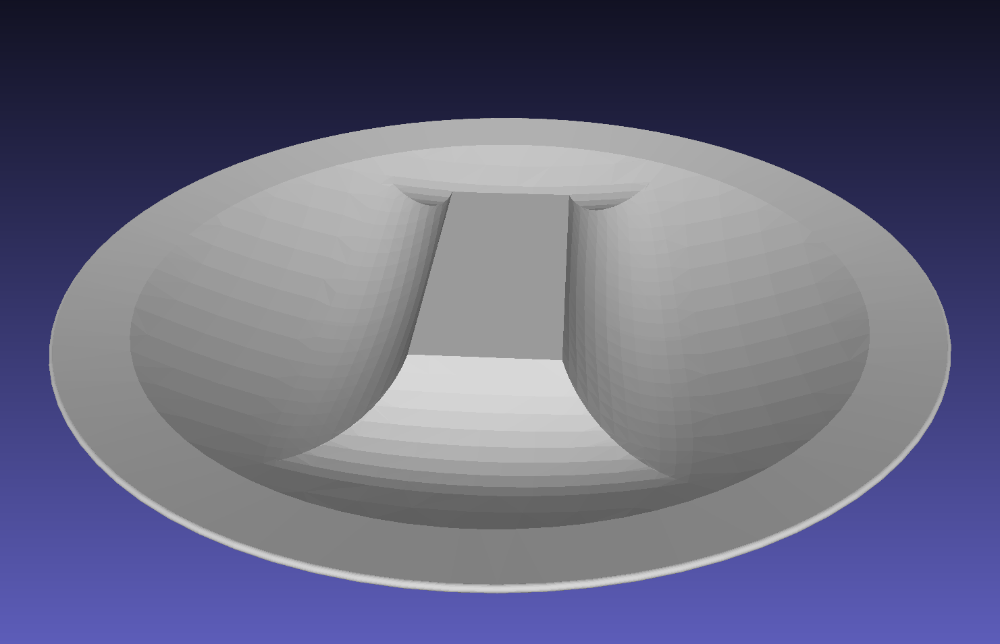

# DenseTact

This document includes dataset for [DenseTact, an Optical Tactile Sensor for Dense Shape Reconstruction](https://arxiv.org/abs/2201.01367). 

## Content

This repository contains the stl and index files of indicators and indenters for training shape reconstruction network for DenseTact.

- Stl files
    - ``Indicators``: This folder includes stl files for indicators. Indicator is a hemispherical-shape shells with 1~2 holes that holds indenter (50mm diameter). 
    
    - ``Indenters``: This folder includes stl files for indeneters. Indenter fits with indicator through hole (25mm diameter).
    

- Index files
    - ``Index_training.csv``: This file contains a list for combinations of indicators and indenters for training dataset.
    - ``Index_test.csv``: This file contains a list for combinations of indicators and indenters for training dataset.
      